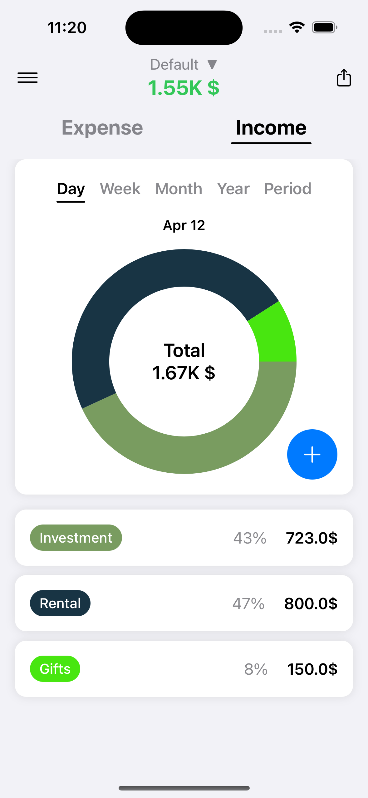
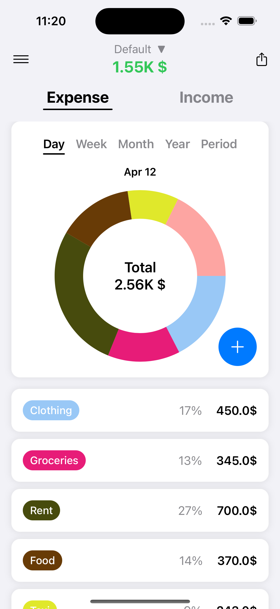
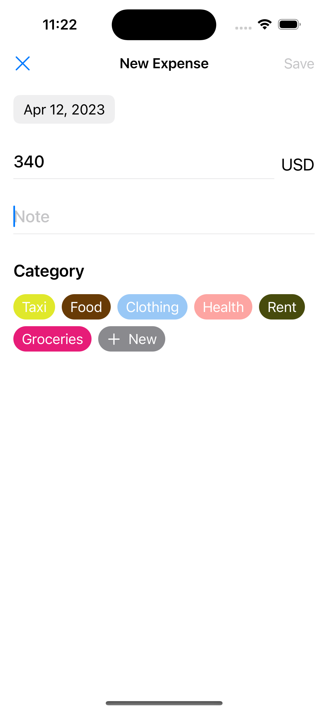
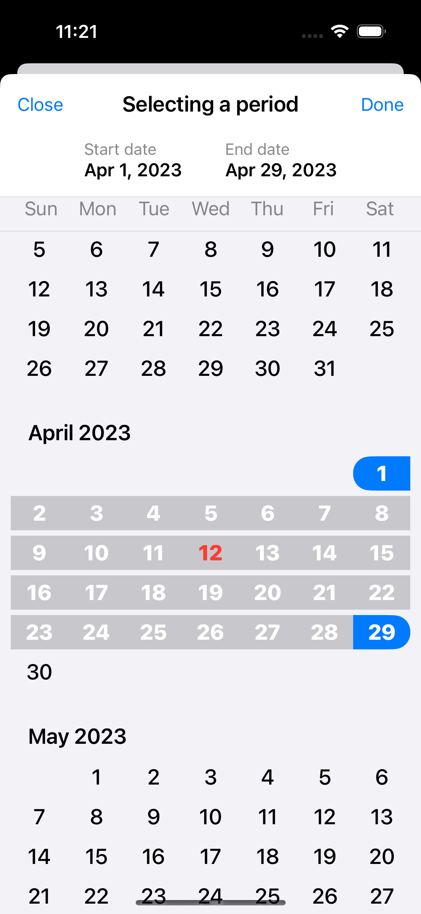
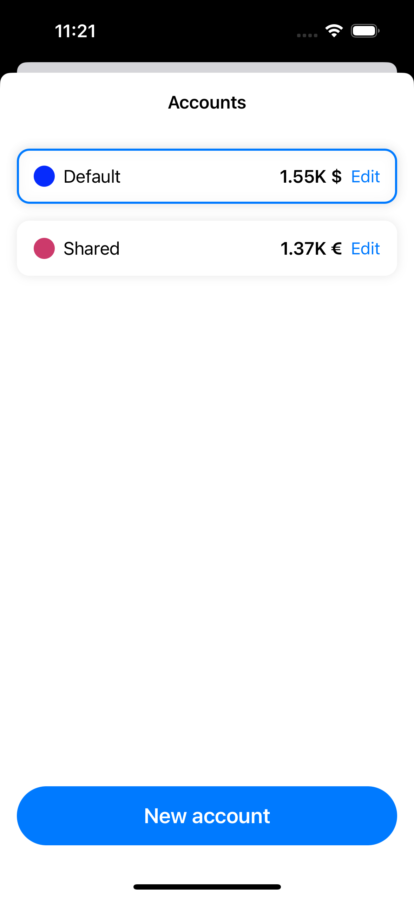
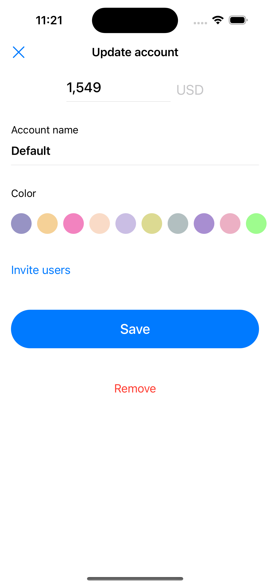
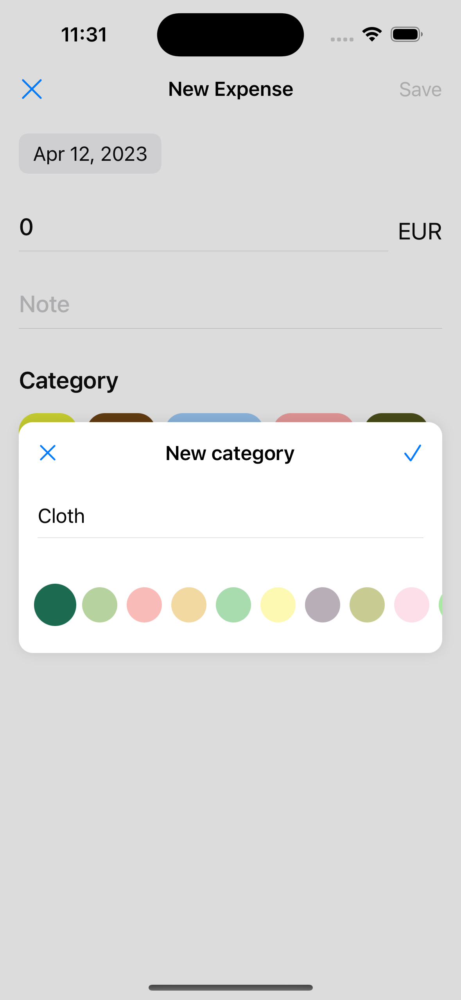
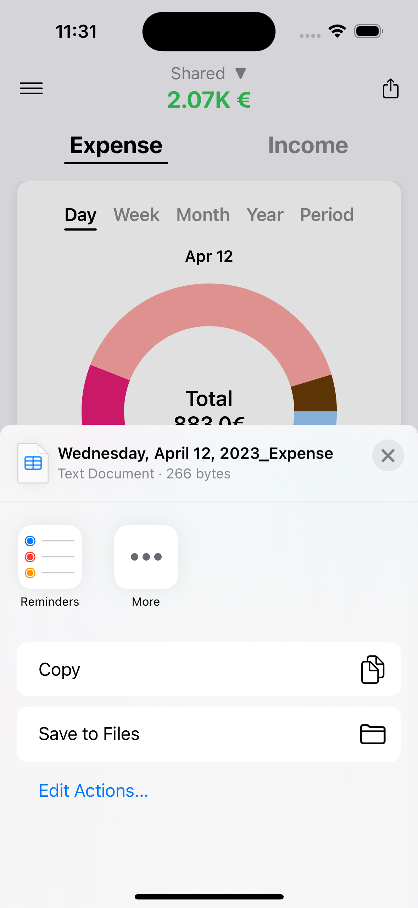

# Finances-Helper

Income and expense tracking app

SwiftUI, MVVM Architecture, iOS 15+

## Features:
- Create an account for any currency
- Adding income/expense
- Residual balance calculation
- Show income/expense by date
- Creating categories and subcategories
- Total income/expense for selected date
- Import CSV file

## Includes
- SwiftUI
- CoreData
- Combine

## Video 📷

## Screenshots 📷

 

 
 

  
   

   
   
   
   ## Author
* [Bogdan Zykov](https://github.com/BogdanZyk)

## License

 Copyright 2022 Bogdan Zykov.
 [License MIT](https://opensource.org/licenses/MIT)
